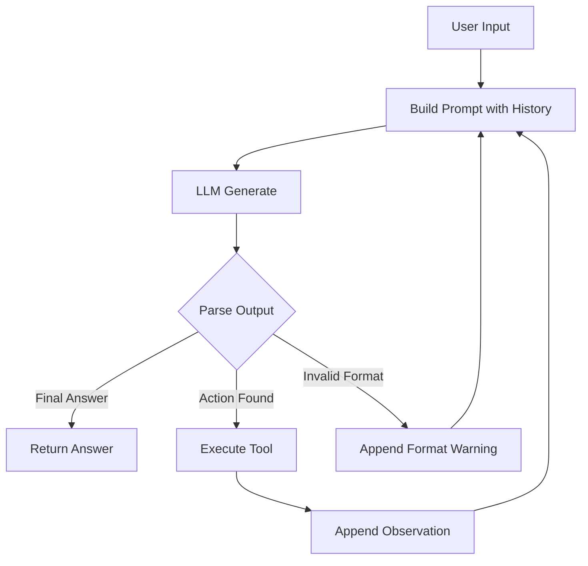

# Group Report: Lab 3 - Production-Grade Agentic System

- **Team Name**: Day 3 Lab Team
- **Team Members**: [Nguyễn Đăng Dương, Hà Xuân Huy, Tôn Thành Đạt]
- **Deployment Date**: 2026-06-01

---

## 1. Executive Summary

Project này xây dựng và so sánh hai cách tiếp cận cho Smart E-commerce Assistant:

- **Baseline Chatbot**: trả lời trực tiếp bằng LLM, không có quyền gọi tool.
- **ReAct Agent**: dùng vòng lặp `Thought -> Action -> Observation -> Final Answer` để gọi tool thật cho dữ liệu tồn kho, mã giảm giá và phí vận chuyển.

Trong final demo, agent giải quyết thành công 2/2 test cases:

- Câu hỏi đơn giản về stock/price của MacBook Air M3.
- Câu hỏi nhiều bước: mua 2 iPhone, áp dụng coupon `WINNER`, ship tới Hanoi và tính tổng tiền.

- **Success Rate**: 100% trên 2 final demo test cases.
- **Key Outcome**: Agent tính đúng tổng tiền `46,807,600 VND` cho bài toán multi-step nhờ gọi tuần tự `check_stock`, `get_discount`, `calc_shipping`. Baseline chatbot chỉ phù hợp với câu hỏi kiến thức chung và không đáng tin cậy cho tính toán có dữ liệu động.

---

## 2. System Architecture & Tooling

### 2.1 ReAct Loop Implementation

Agent được triển khai trong `src/agent/agent.py`. Mỗi lượt xử lý chạy theo luồng:



Các điểm chính:

- Agent reset `history` cho mỗi user query.
- LLM bắt buộc trả lời theo format `Thought`, `Action`, hoặc `Final Answer`.
- `parse_action` và `parse_final_answer` tách output thành tool call hoặc câu trả lời cuối.
- `_execute_tool` map tool name sang function thật trong `TOOL_SPECS`.
- `max_steps` mặc định là 8 để tránh loop vô hạn và chi phí API tăng không kiểm soát.

### 2.2 Tool Definitions (Inventory)

| Tool Name | Input Format | Use Case |
| :--- | :--- | :--- |
| `check_stock` | `check_stock(item_name="iPhone")` | Tra cứu sản phẩm, tồn kho, đơn giá VND và cân nặng mỗi sản phẩm. |
| `get_discount` | `get_discount(coupon_code="WINNER")` | Kiểm tra coupon và trả về discount rate. |
| `calc_shipping` | `calc_shipping(weight=0.7, destination="Hanoi")` | Tính phí vận chuyển dựa trên tổng khối lượng và thành phố nhận hàng. |

Tool data hiện có:

- Products: iPhone 15, MacBook Air M3, AirPods Pro 2.
- Coupons: `WINNER` giảm 10%, `VIP` giảm 20%.
- Shipping destinations: Hanoi, Ho Chi Minh/HCMC, Da Nang, fallback default rate.

### 2.3 LLM Providers Used

- **Primary**: Gemini via `google-generativeai`, model `gemini-2.5-flash-lite`.
- **Secondary (Backup)**: OpenAI provider supported by `src/core/openai_provider.py`.
- **Local Option**: Phi-3 GGUF via `llama-cpp-python`, loaded only when `DEFAULT_PROVIDER=local`.

Provider switching được đóng gói trong `src/core/provider_factory.py`, giúp `chatbot.py` và `run_agent.py` dùng chung interface `LLMProvider`.

---

## 3. Telemetry & Performance Dashboard

Telemetry được ghi vào `logs/2026-06-01.log` dưới dạng JSON events:

- `AGENT_START`
- `AGENT_STEP`
- `TOOL_CALL`
- `AGENT_END`

Final test run gồm 2 task:

| Case | Steps | Tool Calls | Final Result |
| :--- | ---: | ---: | :--- |
| Multi-step order | 4 | 3 | Correct, total `46,807,600 VND` |
| MacBook stock lookup | 2 | 1 | Correct, stock `15`, price `28,990,000 VND` |

Performance metrics từ final run:

- **Average Latency per LLM Step**: khoảng 1308ms.
- **P50 Latency**: khoảng 1170ms.
- **Max Latency**: 2172ms.
- **Average Tokens per Task**: khoảng 2153 tokens.
- **Total Tokens for Final Test Suite**: 4306 tokens.
- **Total Cost of Test Suite**: chưa tính bằng tiền vì project chưa map token usage sang pricing table. Token usage đã được log đủ để bổ sung cost dashboard sau.

Latency theo step trong final run:

| Case | Step Latencies |
| :--- | :--- |
| Multi-step order | 1301ms, 922ms, 1115ms, 2172ms |
| Stock lookup | 1211ms, 1129ms |

---

## 4. Root Cause Analysis (RCA) - Failure Traces

### Case Study 1: `current_prompt` referenced before assignment

- **Input**: Multi-step order prompt in `run_agent.py`.
- **Observed Error**: `UnboundLocalError: local variable 'current_prompt' referenced before assignment`.
- **Root Cause**: Trong `ReActAgent.run`, code gọi `self.llm.generate(current_prompt, ...)` trước khi gán `current_prompt`.
- **Fix**: Tạo prompt ở đầu mỗi loop bằng `current_prompt = self._build_prompt(user_input)`, sau đó append LLM output và Observation vào `self.history`.
- **Impact**: Agent có thể duy trì context qua nhiều bước và hoàn thành loop ReAct.

### Case Study 2: Tool argument mismatch `weight_kg` vs `weight`

- **Input**: "I want to buy 2 iPhones using code 'WINNER' and ship to Hanoi..."
- **Observation**: Agent gọi `calc_shipping(weight_kg=0.7, destination="Hanoi")`, nhưng function thật nhận `weight`.
- **Root Cause**: Tool spec và system prompt dùng tên tham số `weight_kg`, trong khi `calc_shipping.py` định nghĩa `calc_shipping(weight, destination)`.
- **Fix**: Đồng bộ tool spec và system prompt sang `calc_shipping(weight=0.7, destination="Hanoi")`.
- **Result**: Final run giảm từ 5 steps xuống 4 steps cho multi-step order vì agent không cần tự sửa lỗi argument.

### Case Study 3: Gemini API PermissionDenied 403

- **Input**: Chạy `chatbot.py` với provider Google.
- **Observed Error**: `google.api_core.exceptions.PermissionDenied: 403 Your project has been denied access`.
- **Root Cause**: API key hoặc Google project không có quyền gọi Gemini model, không phải lỗi logic của chatbot.
- **Mitigation**: Kiểm tra `GEMINI_API_KEY`, bật đúng API/model access, hoặc chuyển sang provider khác qua `.env`.

---

## 5. Ablation Studies & Experiments

### Experiment 1: Tool Spec v1 vs Tool Spec v2

- **v1**: Prompt hướng dẫn `calc_shipping(weight_kg=...)`.
- **v2**: Prompt và registry thống nhất `calc_shipping(weight=...)`.
- **Result**: Multi-step order giảm từ 5 LLM steps xuống 4 LLM steps. Invalid tool argument được loại bỏ.

### Experiment 2: Broken ReAct Loop vs Working ReAct Loop

- **Before**: `current_prompt` chưa được khởi tạo, agent crash trước bước LLM đầu tiên.
- **After**: `current_prompt` được build từ user input và history ở mỗi loop.
- **Result**: Agent hoàn thành đúng cả 2 final demo cases.

### Experiment 3: Chatbot vs Agent

| Case | Chatbot Result | Agent Result | Winner |
| :--- | :--- | :--- | :--- |
| Simple coupon Q&A | Correct/helpful general explanation | Also possible, but overkill | Draw |
| Multi-step iPhone order | Không có tool nên không thể đảm bảo số liệu live | Correct: `46,807,600 VND` using 3 tools | **Agent** |
| Stock lookup | Không đáng tin cậy nếu không có dữ liệu thật | Correct: calls `check_stock` | **Agent** |

Key insight: chatbot phù hợp với câu hỏi kiến thức chung, còn agent phù hợp hơn cho workflow cần dữ liệu chính xác, tính toán và nhiều bước phụ thuộc nhau.

---

## 6. Production Readiness Review

- **Security**: API keys nằm trong `.env`, không hard-code trong source. Cần đảm bảo `.env` không được commit.
- **Guardrails**: `max_steps` giới hạn loop để tránh infinite loop và chi phí API tăng.
- **Tool Safety**: Tool calls chỉ được lấy từ `TOOL_SPECS`; unknown tool trả về lỗi thay vì execute tùy ý.
- **Observability**: Logs JSON ghi input, step, latency, token usage, tool args và tool results.
- **Reliability**: Parser hiện hỗ trợ format `Action: tool(arg="value")`. Cần bổ sung test cho malformed action, invalid coupon, unknown product.
- **Provider Resilience**: Có provider factory cho Gemini, OpenAI và local. Nên thêm fallback tự động nếu Google trả 403/quota exceeded.
- **Scaling**: Khi workflow phức tạp hơn, có thể chuyển sang state graph như LangGraph để quản lý branching, retry và validation rõ hơn.
- **Cost Monitoring**: Token usage đã có trong log, bước tiếp theo là thêm pricing table để tính cost per task.

---

## Appendix: Final Demo Evidence

### Multi-step Order

Input:

```text
I want to buy 2 iPhones using code 'WINNER' and ship to Hanoi.
What is the total price in VND? Show your calculation step by step.
```

Tool trace:

```text
check_stock(item_name="iPhone")
-> product=iPhone 15; stock=42; unit_price_vnd=25990000; weight_kg=0.35

get_discount(coupon_code="WINNER")
-> discount=0.1

calc_shipping(weight=0.7, destination="Hanoi")
-> 25600
```

Calculation:

```text
Subtotal: 25,990,000 * 2 = 51,980,000 VND
Discount: 51,980,000 * 10% = 5,198,000 VND
After discount: 51,980,000 - 5,198,000 = 46,782,000 VND
Shipping: 25,600 VND
Total: 46,782,000 + 25,600 = 46,807,600 VND
```

### Stock Lookup

Input:

```text
How many MacBook Air M3 units are in stock and what is the unit price in VND?
```

Result:

```text
Stock: 15 units
Unit price: 28,990,000 VND
```

---
